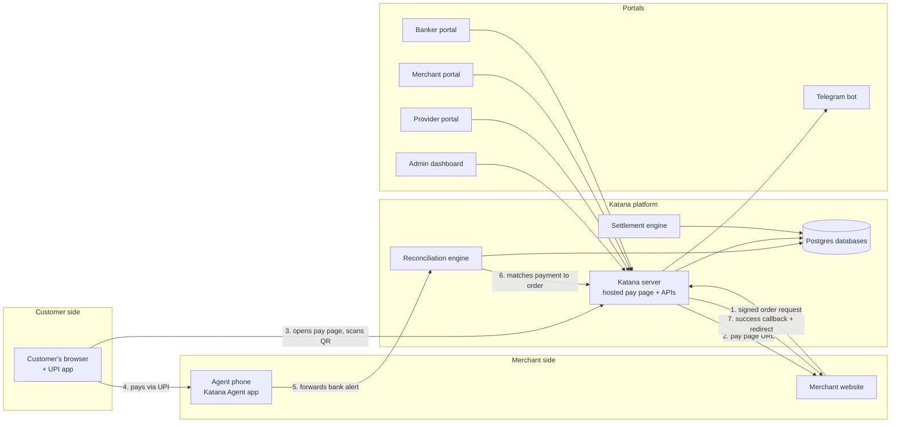
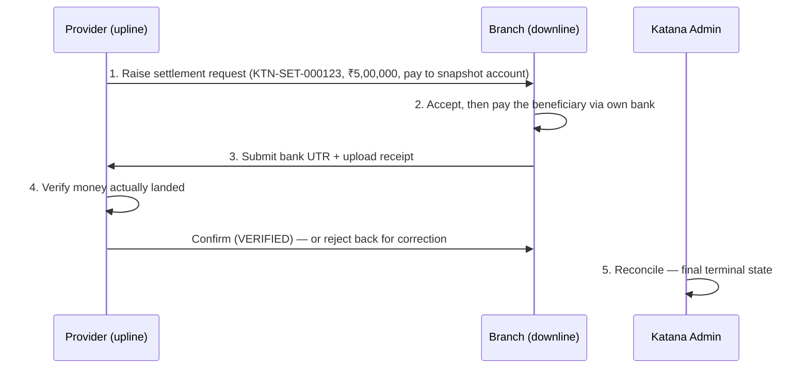

# How Katana Works

**A complete, plain-English guide to the Katana Payment Orchestrator — for teammates, partners, and anyone who wants to understand the system from top to bottom.**

*Last updated: 16 July 2026*

---

## 1. What is Katana, in one minute

Katana is a **payment collection and settlement platform for UPI payments in India**.

Imagine you run an online business. A customer wants to pay you ₹2,000. Three hard problems immediately appear:

1. **Collecting** — you need a payment page where the customer can scan a QR code or tap into their UPI app (Paytm, PhonePe, Google Pay) and pay you.
2. **Knowing you got paid** — UPI money lands in a bank account, but your website has no automatic way of knowing *that particular customer's* ₹2,000 arrived. Someone has to match "money that came in" to "order that was placed." Doing this by hand, all day, for hundreds of payments, is slow and error-prone.
3. **Moving money onward** — once collected, the money has to be settled between the parties in the chain (the branch that collected it, the provider above it, and Katana itself), with commissions calculated, proofs attached, and every step recorded.

Katana solves all three. A merchant's website talks to Katana through a simple, secure API. The customer pays on a Katana-hosted payment page. Katana then **detects the payment automatically** — its signature trick is a small Android app running on a phone that watches incoming bank SMS and app notifications, so payments are confirmed within seconds *without needing any special access from the banks or UPI apps*. Finally, Katana runs the whole settlement workflow: who owes whom, commission math, proof uploads, verification, and an audit trail of every step.

Everything is managed through four web portals — one each for Katana's own staff, for providers, for merchants (branches), and for bankers — plus a Telegram bot that sends the business reports straight to the admins' phones.

---

## 2. The problem Katana really solves (and why it's clever)

Most payment companies get told when a payment succeeds because the bank or gateway calls their servers ("webhooks"). Katana operates in a world where **that luxury doesn't exist** for its main collection channel: payments arrive as ordinary UPI credits into merchant accounts on apps like Paytm for Business — and those apps don't offer an API to query.

So how do you *know* a payment happened?

The answer everyone can relate to: **the same way a shopkeeper knows — the phone buzzes.** When money lands in a bank account, the bank sends an SMS, and the merchant app shows a notification: *"₹2,000 received from customer@upi."*

Katana automates the shopkeeper. A dedicated Android phone sits at the merchant's side running the **Katana Agent app**. It reads those SMS messages and notifications the instant they arrive, extracts the amount, the payment reference number, and the payer's details, and forwards them to Katana's servers. Katana's matching engine then figures out *which* pending order that payment belongs to and flips it to "paid" — usually in under a second.

This "on-device capture" approach is a deliberate, foundational design decision. It means Katana needs **no bank partnership, no gateway webhook, and no API keys from Paytm** to confirm payments — just a phone with the agent installed.

---

## 3. Who's who — the cast of characters

| Role | Plain-English description |
|---|---|
| **Customer / Payer** | The person paying. They only ever see the payment page with the QR code. |
| **Merchant (a.k.a. "Branch")** | The business collecting payments. Has a website integrated with Katana, a merchant portal login, and usually an agent phone. In Katana's hierarchy, merchants are the "downline." |
| **Provider** | A partner who manages a group of branches. Providers raise settlement requests to their branches, verify money received, and manage vendors. The "upline." |
| **Banker** | A capital partner in the DT business model (explained in §9). Bankers buy traffic capacity in advance and earn commission on the volume it carries. |
| **Katana (Admin)** | The platform itself and its staff — super admins, finance, compliance, risk, operators. They see everything, resolve edge cases, and arbitrate disputes. |
| **The Agent phone** | Not a person — but a full member of the cast. An Android device running the Katana Agent app at the merchant's location, watching for payment alerts 24/7. |

---

## 4. The big picture

The rest of this document walks through each arrow in detail.

---

## 5. The life of a payment — step by step

This is the heart of the system. Follow one ₹2,000 payment from click to confirmation.

### Step 1 — The merchant's website asks Katana for an order

When the customer clicks "Pay" on the merchant's site, the merchant's server sends Katana a request: *"Create an order for ₹2,000, transaction ID ORDER-12345, customer Ravi, ravi@email.com."*

**How does Katana know the request is genuine?** Every merchant is issued two things when they onboard:

- a **Key** — a public identifier, like a username (looks like `mk_a1b2c3...`)
- a **Salt** — a secret, shown only once, like a password that is never sent over the wire

The merchant's server combines the order details and the Salt, and runs them through a one-way mathematical function (SHA-512) to produce a **signature** — a long string of characters that could only have been produced by someone who knows the Salt. Katana, which also knows the Salt, computes the same signature and compares. If they match, the order is genuine and untampered. If even one rupee of the amount were changed in transit, the signature would no longer match and Katana would reject it.

> **Layman's analogy:** it's like a wax seal on a letter. Anyone can read the address on the envelope (the Key), but only the true sender owns the seal stamp (the Salt). If the seal is intact and matches, the letter is authentic.

The API endpoint is `POST /api/v1/katana-pay/order`. It's **idempotent** — if the merchant's server accidentally sends the same order twice (networks are unreliable), Katana recognises the duplicate transaction ID and returns the *same* order instead of creating a second one. The merchant can also pass a `return_url` (where to send the customer's browser afterwards) and a `notify_url` (where to send the machine-to-machine result).

Katana replies with a **payment page URL** — `https://katanapay.co/pay/<order-id>` — and the merchant redirects the customer's browser there.

Behind the scenes, Katana has also decided **which UPI account should receive the money**: the merchant's configured settlement VPA (a VPA is a UPI address, like `shopname@bank`), possibly with a pool of backup VPAs for failover, and routed through a sub-merchant-ID if one is configured. Very large payments (₹50,000+ by default) are automatically flagged for **manual review hold** — they will not auto-confirm without a human look.

### Step 2 — The hosted payment page

The customer lands on a clean page showing the amount and a **UPI QR code**, plus one-tap buttons for Paytm, PhonePe, Google Pay, or any UPI app. The QR code encodes a standard UPI payment string: pay *this VPA*, *this amount*, reference *this order*.

The page quietly polls Katana every fraction of a second: *"paid yet? paid yet?"* (using an efficient long-poll, so it feels instant without hammering the server). There's also an escape hatch: an **"Already paid? Upload screenshot"** button. If the customer paid but confirmation is delayed, they can submit their payment screenshot and optionally the reference number; the order is then parked "under verification" for an operator to review, instead of expiring.

An unpaid order **expires after 15 minutes** — but, importantly, expiry is *soft*: if the real money shows up late, the order is revived to SUCCESS rather than the payment being stranded (more in Step 5).

### Step 3 — The customer pays

The customer scans the QR with their UPI app and authorises ₹2,000. The money moves through the UPI network from their bank account directly into the merchant's receiving account. **Katana is not in the money flow at this moment** — this is a normal person-to-merchant UPI payment. Which creates the detection problem…

### Step 4 — Katana finds out: the agent phone reports in

Seconds after the money lands, the merchant's bank sends an SMS, and/or the merchant app (Paytm for Business, etc.) pops a notification on the agent phone. The Katana Agent app catches it through whichever channel fires first, parses out:

- the **amount** (₹2,000)
- the **UTR/RRN** — the payment's unique 12-digit reference number (think of it as the payment's fingerprint; every UPI transaction in India gets exactly one)
- the **payer's VPA** and/or **name**

…and immediately POSTs it to Katana's ingestion endpoint (`/api/v1/txn-alert`), with a unique nonce and deduplication so the same alert never gets processed twice. If the phone is offline, the alert is queued locally and retried later — **a real credit is never lost**.

(The agent is a genuinely interesting piece of engineering — it gets its own full section, §6.)

### Step 5 — The matching brain decides

Katana's **reconciliation engine** (`txn-reconcile.ts` — the densest logic in the codebase) now has a bank alert in hand and must answer: *which pending order is this payment for, and are we confident enough to auto-confirm?*

It scores the match with a **confidence system**:

| Evidence found | Confidence |
|---|---|
| The alert contains the exact order ID (some app notifications echo it) | 100 |
| The alert's 12-digit RRN exactly matches an order already tagged with it | 100 |
| Amount matches + payer VPA matches + order is recent (30-min window), exactly one candidate | 95 |
| Amount matches + a bank UTR present, exactly one candidate | 95 |
| Amount matches, exactly one candidate, from a trusted device | 90 |
| Amount matches but *two or more* orders could be it (ambiguous) | 60 |

The rule: **auto-confirm only if confidence ≥ 90 AND the reporting device is marked TRUSTED AND it isn't a duplicate or a suspicious sender.** Anything below that becomes a **manual case** in the operator queue with a stated reason (low confidence, ambiguous, unmatched, duplicate, untrusted device, amount conflict), for a human to resolve.

Several safety nets run before matching even starts:

- **OTP filter** — one-time-password and login SMS are discarded outright (both on the phone and again on the server).
- **Fake-sender detection** — an SMS claiming to be from a bank but actually sent by a personal 10-digit number raises a security alert instead of a confirmation.
- **Replay/duplicate detection** — the same RRN seen again within 24 hours, an identical message hash, or a reused nonce are recognised as re-scrapes, not new money.
- **Device trust ladder** — devices are UNKNOWN → TRUSTED → SUSPENDED/REVOKED. Only trusted devices can auto-confirm; a brand-new unknown phone's alerts go to the manual queue.

One subtle, powerful feature: **enrich-merge**. The same payment often arrives via two channels — say an email alert that carries the order ID but no RRN, then an on-screen scrape that carries the RRN but no order ID. Rather than creating two records, the engine recognises they describe the same payment (matching by order ID, or merchant + amount + payer-VPA-prefix within a window, with a backfill window of up to 14 days) and **folds them into one enriched record**. The VPA matching even handles the fact that different channels mask the payer's address differently (`96***53@axl` vs `9611XX@axl`).

### Step 6 — Confirmation, and everyone finds out

All roads lead to a single gatekeeper function, `confirmPoolPayOrder` — the *only* place in the system that can flip an order to paid. It enforces the invariants:

- **One RRN settles exactly one order.** A duplicate UTR against a second order is refused. This blocks the classic fraud of showing the same payment screenshot for two orders.
- **Final statuses are locked.** A SUCCESS can't later become FAILED. Replaying the same confirmation is harmlessly idempotent; a *conflicting* one is rejected.
- **EXPIRED is soft.** A genuine late credit revives an expired order to SUCCESS.

On success, three things happen at once:

1. **The payment page flips** to "Payment received" (the long-poll returns within ~half a second), waits 2.5 seconds, and redirects the customer's browser back to the merchant's `return_url` with the order ID, status, and RRN.
2. **A signed server-to-server callback** fires to the merchant's `notify_url`/webhook: a JSON payload (`STATUS: "Captured"`, `RESPONSE_CODE: "000"`, the `RRN`, amount, etc.) with a SHA-256 `HASH` computed with the merchant's Salt — so the merchant's server can verify the callback is genuinely from Katana before shipping the goods. Delivery goes through a retrying outbox, so a temporarily-down merchant server doesn't miss it.
3. **The record is written** — the order row updated, the alert stored, timeline events appended, and dashboards/Telegram reports reflect it.

Total elapsed time in the happy path: **a few seconds from the customer's thumb to the merchant's "order confirmed" page.**

---

## 6. The Android agent — Katana's secret weapon

The agent (`apps/android-agent`, a Kotlin app, sideloaded onto dedicated phones as `katana-agent.apk`) deserves its own chapter, because it does things few payment systems do.

### Four capture channels, one funnel

1. **Bank SMS** — a broadcast receiver with maximum priority catches every incoming SMS, even if the app was killed. A heuristic parser tuned to Indian bank formats extracts amount (carefully skipping "available balance" figures), reference number, and payer details, and rejects debits and OTPs.
2. **App notifications** — a notification-listener service reads the pushes from banking/UPI apps. A denylist of "noise apps" (Gmail, WhatsApp, browsers…) ensures a bank *email preview* is never mistaken for a real credit. SMS and notification for the same credit are de-duplicated within a 3-minute window.
3. **On-screen scraping (the star of the show)** — an accessibility service that reads merchant apps' screens to capture the full 12-digit RRN, which SMS and notifications often omit:
   - **Paytm for Business** masks the RRN on screen. The agent scrolls to it, takes a screenshot, *finds the blue "Copy" link by its pixel colour*, dispatches a real tap gesture at those coordinates (a synthetic click won't trigger Paytm's WebView), then reads the RRN off the clipboard and validates it. Fully automatic.
   - **Airtel Payments Bank Merchant** shows the RRN unmasked in its list — the agent reads it passively, pairing RRN↔amount↔payer by their position on screen, and strictly requires 12 digits (so 15-digit settlement references are never confused for RRNs).
   - **Google Pay for Business** (a Flutter app) is read through its accessibility descriptions.
4. **Email (server-side)** — the agent can register the merchant's alert mailbox with the server, which then polls it over IMAP every minute and feeds credits into the same pipeline.

### "Get RRN" — the on-demand capture button

Sometimes a credit arrives without its RRN (e.g., via email). An operator or provider can press **Get RRN** on the dashboard. This creates a *capture request* in a queue; the agent polls that queue every 15 seconds, and when it sees the request it re-sweeps the Paytm transaction list on-screen to hunt down the missing RRN and upload it. The server even short-circuits when it can: if a sibling record already holds that RRN, it resolves the request without bothering the phone at all. The reconciler auto-closes the request the moment the RRN lands. The same mechanism also fires **automatically** — an email credit with no RRN and a recently-alive device raises its own capture request with no human involved.

### Staying alive

Android aggressively kills background apps, so the agent fights back with layers: a permanent foreground service, a WorkManager heartbeat every 15 minutes that also flushes the retry queue, auto-restart after phone reboot, and a request to be excluded from battery optimisation. Every heartbeat reaches the server (`/api/v1/device/heartbeat`), so the dashboard always knows which phones are alive.

And if the pipeline silently breaks anyway? A **capture-health watchdog cron** notices the pattern "credits are arriving but no RRNs are being read" for merchants that normally capture RRNs, raises an incident on the dashboard, and auto-resolves it when the backlog clears.

---

## 7. What is an RRN, and why does Katana obsess over it?

**RRN (Retrieval Reference Number)** — also loosely called UTR — is the unique 12-digit number the UPI network assigns to every transaction. It appears on both the payer's and payee's statements. It is:

- **the payment's fingerprint** — no two UPI payments share one;
- **the strongest possible matching key** — an RRN match is 100% confidence;
- **the integrity anchor** — "one RRN settles exactly one order" is what makes screenshot-reuse fraud impossible;
- **the customer-service handle** — it's echoed to the payer on the redirect and to the merchant in the callback, so any dispute can be traced through the banks.

Much of Katana's cleverest machinery (the accessibility scraper, Get RRN, enrich-merge, capture-health) exists purely to make sure every payment record ends up holding its true RRN.

---

## 8. Moving the money — settlements

Collecting payments is half the job. The other half: the branch is now holding collected money that needs to move up the chain. Katana runs this as a formal, auditable workflow between **Provider (upline)** and **Branch/Merchant (downline)**, refereed by **Admin (Katana)**.

### The happy path

Every request:

- gets a human-readable reference (`KTN-SET-NNNNNN`);
- **snapshots the beneficiary account** at raise time — the branch always sees exactly the account it was told to pay, even if the provider later edits their accounts;
- **snapshots the commission breakdown** (below) so pricing changes never rewrite history;
- passes a **balance guard**: the request must fit the branch's *available balance*.

### The balance math (simple and honest)

> **Available = Collected − Already settled − Currently in flight**

"Collected" is the sum of successful pay-ins; "already settled" counts only VERIFIED/RECONCILED settlements; "in flight" blocks the amount of any settlement that has been raised but not finished — so the same rupee can never be requested twice.

### The state machine — one table rules everything

All statuses, all transitions, who may perform them, and what data each requires live in **one transition table** (`settlement-fsm.ts`). Both the API and the portal buttons render from the *same* table, so the UI can literally never offer an action the server would refuse.

Statuses run `REQUESTED → ACCEPTED → PROCESSING → PAID → VERIFIED → RECONCILED`, with realistic side-paths: partial payment, failed, insufficient balance, invalid beneficiary, hold/resume, escalate to Katana, dispute, correction-required, reassign to another branch, admin lock/unlock, reverse, cancel. Every transition appends an **immutable event** to the timeline (visible in the portals), writes an audit log, and fires a **signed webhook** to the provider's configured notification channel.

Proof uploads are hardened: only PNG/JPEG/WEBP/PDF, 12 MB cap, magic-byte content check, SHA-256 fingerprint, stored outside the web root, and streamed back only to authorised roles.

### Commission rules — versioned, never edited

Charges are defined in basis points across three layers (**upline / Katana / downline**) plus a fixed fee and GST, with min/max clamps. Rule resolution is most-specific-wins: a provider+branch rule beats a provider-wide rule beats the global default. Crucially, **rules are never edited in place** — a change end-dates the old rule and creates a new version (with a mandatory reason), and every settlement carries a snapshot of the exact charges applied. History cannot be quietly rewritten.

### The USDT option

A settlement can be paid in **USDT** (a dollar-pegged cryptocurrency) instead of a bank transfer, on the TRC20/ERC20/BEP20 networks. Katana's admin declares a daily settlement rate per network (market rate, buy/sell, spreads, network fee). When a USDT settlement is raised, **that day's rate is locked into the request**, and the quantity is computed as *net INR ÷ rate − network fee*. The downline then submits the blockchain transaction hash instead of a bank UTR. No active rate declared for a network → no USDT settlement can be raised on it.

---

## 9. The DT business model — bankers, traffic, and the rolling reserve

This is the commercial layer that turns payment traffic into a three-party business. *(Status note: the schema, portals, and dashboards are built and live; the money engine itself currently runs in "shadow mode" behind a feature flag, exercised through a simulator — it does not yet touch live routing.)*

### The idea

A **banker** is a capital partner who pre-purchases **DT (Digital Token)** — units of payment-traffic capacity. Their money is what underwrites the traffic that flows through the branches they back.

When a banker's purchase is funded and approved (with maker-checker controls), the lot splits **60/40**:

- **60% becomes traffic quota** — spendable routing capacity. As eligible successful traffic flows, quota is reserved and consumed lot-by-lot, oldest first (FIFO).
- **40% becomes the Rolling Reserve** — Katana's security buffer.

### The commission waterfall

On every eligible successful rupee of traffic:

- the **merchant side pays 5.75%** (default; rules are configurable per channel/branch/group/banker/global, most-specific-wins),
- the **banker earns 4.50%**,
- **Katana keeps the spread — 1.25%.**

The engine verifies the invariant *merchant charge − banker commission = Katana margin* on every entry, and mirrors everything into a double-entry shadow ledger.

### The settlement-buffer reserve model (the current design)

The 40% reserve works like a deposit that only shrinks when things are properly settled:

> **Outstanding buffer = everything funded into the 40% − everything released by verified settlements.**

Two rules make it safe:

1. **Refills only ever ADD to the buffer.** When a banker tops up an exhausted lot, the new 40% stacks on top — a small refill can never shrink Katana's security position.
2. **Only verified settlement reconciliation releases buffer**, oldest lot first, partials allowed, and over-releasing is refused by the server.

Bankers get their own **self-service portal** (dashboard, purchases, refills) where their identity always comes from their login session — never from anything they type — and admins/finance run the approvals from the DT dashboards.

---

## 10. The four portals — who sees what

One login page, one session system, four strictly-partitioned worlds. A user's **persona** (SUPER_ADMIN, ADMIN, PROVIDER, MERCHANT, BANKER, plus operational roles like FINANCE, COMPLIANCE, RISK, OPERATOR, SUPPORT) is baked into a tamper-proof signed session cookie, and enforcement happens at **two layers**: an edge middleware that hard-blocks each portal to its persona, and a per-route gate that additionally **scopes every database query** — a provider can only ever see its own branches' rows; a merchant only its own; a banker only its own lots. Sensitive roles can be required to use **TOTP two-factor authentication** with device binding.

| Portal | For | Main things they do |
|---|---|---|
| **Admin dashboard** (`/`) | Katana staff | Everything: providers, branches, transactions, ledger, settlements, routing, reconciliation queue, risk/AML, disputes, KYB, DT business, operator console, user/role admin, webhooks, vault, reporting. |
| **Provider portal** (`/provider-portal`) | Providers (upline) | Dashboard, their branches, transactions (incl. the per-payment VPA credit list), raise & verify settlements, vendors, developer settings (API Key+Salt per branch, signing docs, webhooks), commission, support. |
| **Merchant portal** (`/merchant-portal`) | Branches (downline) | Dashboard, transactions, the downline side of settlements (accept → pay → UTR → receipt), reserves, API keys & integration guide, agent pairing, disputes, profile. |
| **Banker portal** (`/banker-portal`) | Bankers | DT purchases, refills, wallet/utilisation overview. |

Merchant onboarding auto-provisions a login with a one-time password; password changes and admin resets are built in.

---

## 11. The supporting cast

- **Telegram bot (@KatanaHolder_bot)** — admins get business reports in chat: `/today`, `/yesterday`, `/captures`, `/settlements`, `/leads`, `/report`, plus a scheduled daily digest. Locked down twice over: Telegram's webhook secret *and* a numeric admin chat-ID allowlist — strangers who message the bot are only told their own chat ID.
- **Provider notification channels** — each provider can register webhook (signed, live) and email channels for settlement events.
- **Cron watchdogs** — every-minute and daily jobs (guarded by a cron key): pending-order status sweeps, email inbox polling, the capture-health watchdog (§6), and the Telegram daily report.
- **Payment gateway integrations** —
  - **PoolPay** (the primary UPI rail, marketed as *Katana Pay*): configured once at the **provider** level and inherited by every branch, with a cascade of merchant-override → provider config → environment defaults. Secrets never sit in config rows; they're sealed in an encrypted **credential vault**, and requests are signed with PoolPay's SHA-256 scheme (sorted keys, `~`-joined, uppercased hex).
  - **Pine Labs / Plural** — per-merchant API credentials (vaulted), configurable from both admin and merchant portals; the live transaction/RRN-pull connector is the next phase.
  - **PayU** — a classic redirect-to-gateway card rail with its own hosted-page flow and return handler, sharing the same Key+Salt signature mechanics.
- **The public face** — a marketing site at `/katana-pay` (katanapay.co): animated 3D landing experience, features, pricing, API docs, and a partner-inquiry form whose leads flow to the admin dashboard and the Telegram `/leads` command. Public integration guides are published alongside it.

---

## 12. Under the hood — the technology

**One focused application.** The platform is a single **Next.js 15** application (`apps/admin-dashboard`) that serves all four portals, the hosted payment page, the marketing site, and ~200 API routes, with all business logic in TypeScript modules (`src/lib/…`). The Android agent (`apps/android-agent`) is the only other application.

**Database.** One **PostgreSQL** instance organised into ~29 logical databases, one per business domain (provider, merchant, vendor-gateway, ledger, settlement, reconciliation, audit, FIFO, …), accessed with plain SQL through a pooled driver — no ORM. Schema migrations live in `tools/migrations/`, seeds in `tools/seed/`, local bootstrap via Docker Compose.

**Security, in plain terms:**

- Signatures everywhere: merchant orders in, merchant callbacks out, device alerts (HMAC + timestamp with a ±5-minute replay window), settlement webhooks, cron endpoints.
- Secrets (gateway keys, merchant salts) live in an encrypted credential vault, never in plain config.
- Sessions are signed cookies with an 8-hour life; portals are partitioned at the edge *and* row-scoped in every query; optional TOTP MFA with device binding.
- Uploads are content-verified (magic bytes), size-capped, hashed, and stored outside the web root.
- Immutable audit trails: settlement events, order timelines, audit logs, security alerts.

**Deployment.** A Linux VPS runs the app under **systemd** behind **nginx** at **katanapay.co** (migrating from the older glhouse.shop domain — device heartbeats record which domain each phone uses so the cutover can be tracked). Deploys are rsync → install → build → restart. Scheduled jobs run from the system crontab hitting the key-guarded cron endpoints. The agent APK is built with Gradle, signed with a stable key (so updates install over the old version), and served from the site itself.

---

## 13. Glossary

| Term | Meaning |
|---|---|
| **UPI** | India's instant bank-to-bank payment network (what powers Paytm/PhonePe/GPay payments). |
| **VPA** | Virtual Payment Address — a UPI "account name" like `shop@bank`. |
| **RRN / UTR** | The unique 12-digit reference number of a UPI transaction — the payment's fingerprint. |
| **Key + Salt** | A merchant's public identifier + secret used to sign API requests and verify callbacks. |
| **Signature / Hash** | A cryptographic seal proving a message is authentic and untampered. |
| **Pay-in** | Money coming in (a customer paying a merchant). |
| **Settlement** | Moving collected money between parties, with proof and verification. |
| **Upline / Downline** | Provider (raises settlements, verifies receipt) / Branch (pays out, submits proof). |
| **Reconciliation** | Matching "money that arrived" to "order that was placed." |
| **Agent** | The Android app on a merchant-side phone that captures payment alerts. |
| **Accessibility scraping** | Reading a payment app's own screen to extract data (like the masked RRN) it doesn't otherwise expose. |
| **Manual case** | A payment the engine wasn't confident enough to auto-confirm, queued for a human. |
| **DT (Digital Token)** | Pre-purchased payment-traffic capacity in the banker business model. |
| **Rolling Reserve** | The 40% security buffer held from each banker lot, released only by verified settlements. |
| **USDT** | A dollar-pegged cryptocurrency Katana supports as a settlement payout option. |
| **Idempotent** | Safe to repeat — sending the same request twice has the same effect as once. |
| **Webhook / Callback** | One server automatically notifying another that something happened. |
| **FIFO** | First-in, first-out — oldest lot/queue item is used first. |
| **Maker-checker** | One person proposes, a different person approves — no single-handed money actions. |

---

## 14. Frequently asked "but how…?"

**But how does Katana confirm payments without a bank API?**
The agent phone. Banks and merchant apps already announce every credit via SMS and notifications; the agent reads those announcements the instant they appear and forwards them. Add screen-reading for the RRN, and you have full, real-time payment data with zero bank integration.

**But what if someone fakes a payment SMS?**
Several walls: the device must be marked TRUSTED by an admin before its alerts can auto-confirm anything; SMS from personal numbers masquerading as banks are flagged as security alerts; every alert carries a nonce and hash so replays are caught; and an RRN can only ever settle one order — a reused screenshot bounces off.

**But what if the phone dies / the app is killed?**
Foreground service + heartbeats + reboot auto-start + a local retry queue mean alerts survive outages; and the capture-health watchdog raises an incident on the dashboard if a merchant's capture pipeline goes quiet while credits keep arriving.

**But what if two orders have the same amount at the same time?**
Confidence drops to 60 (ambiguous) and the payment goes to the manual queue instead of guessing. The RRN or payer VPA usually disambiguates; if not, a human does.

**But what if a customer pays after the 15-minute window?**
Expiry is soft. The late credit still matches (the window includes recently-expired orders) and revives the order to SUCCESS. The money is never stranded.

**But can a settlement be tampered with after the fact?**
No — beneficiary and commission are snapshotted at raise time, every transition appends to an immutable event log, commission rules are versioned rather than edited, and only the roles the transition table permits can act at each step.
